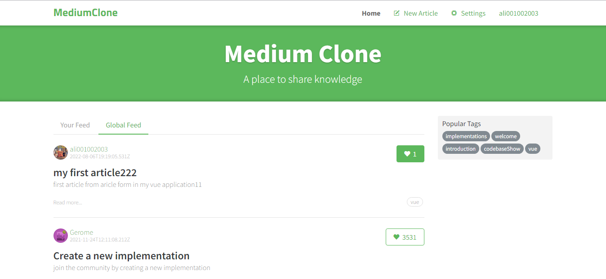
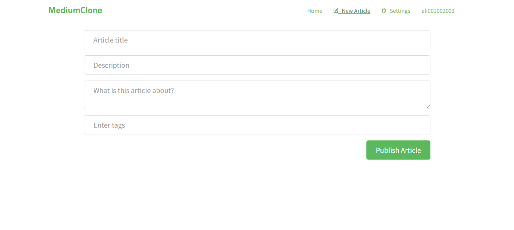
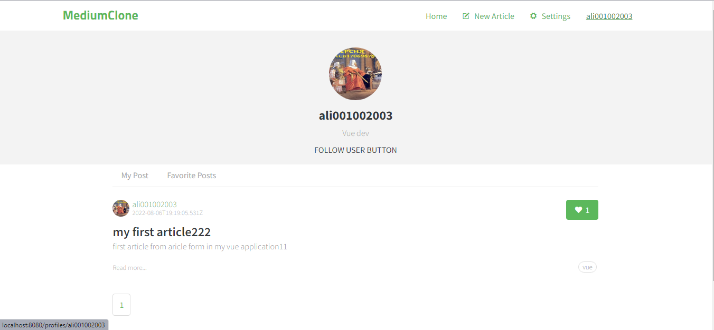
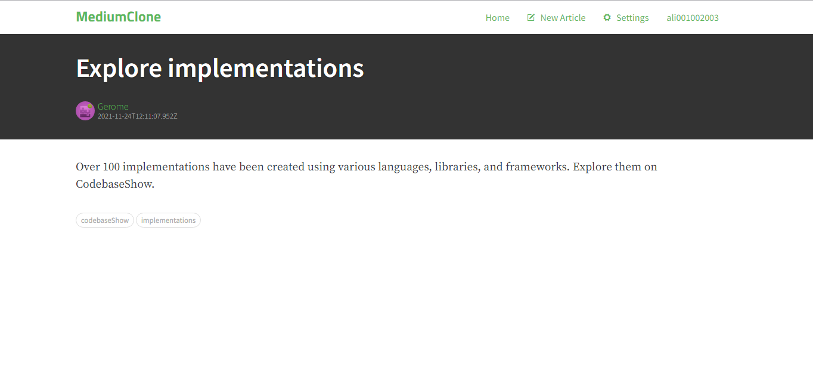

# Medium
### Vue.js frontend application
Учебный проект клон сайта [Medium realworld](https://demo.realworld.io/)
Используется готовый API https://conduit.productionready.io/api

####В проекте используется:

-Vue cli <br>
-Vuex <br>
-Vue Router <br>
-Axios <br>
-Bootstrap <br>







## Project setup
```
yarn install
```

### Compiles and hot-reloads for development
```
yarn serve
```

### Compiles and minifies for production
```
yarn build
```

### Lints and fixes files
```
yarn lint
```

### Customize configuration
See [Configuration Reference](https://cli.vuejs.org/config/).
